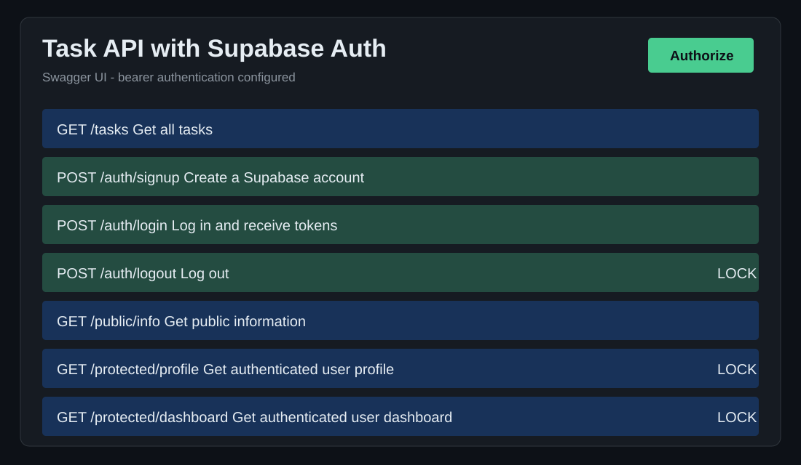

# Todo-CRUD-API

A Dockerized PostgreSQL task API with Supabase Auth. It supports sign up, login, JWT-protected routes, logout, and persistent tasks.

## Features

- Root and health-check endpoints
- Create, read, update, and delete tasks
- Input validation and clear JSON errors
- Interactive Swagger UI documentation
- PostgreSQL persistence with Docker Compose
- Supabase Auth sign up and login
- Reusable bearer-token middleware for protected routes

## Technology stack

- Node.js
- Express
- JavaScript
- swagger-ui-express
- OpenAPI 3.0
- PostgreSQL via node-postgres (`pg`)
- Docker and Docker Compose
- Supabase Auth with @supabase/supabase-js

## Installation

```bash
npm install
```

## Run the complete stack

```bash
cp .env.example .env
docker compose up
```

Docker Compose starts both the API and PostgreSQL database with one command. The API is available at <http://localhost:3000>.

To stop the stack, press `Ctrl+C` and run:

```bash
docker compose down
```

The Postgres volume keeps task data even after `docker compose down` and `docker compose up`.

Before running, copy `.env.example` to `.env` and set `SUPABASE_URL` and `SUPABASE_KEY` to your own Supabase Project URL and anon/publishable key. Never use a `service_role` or `sb_secret_` key.

Swagger UI: <http://localhost:3000/docs>

## API endpoints

| Method | Endpoint | Purpose | Success status |
| --- | --- | --- | --- |
| GET | `/` | Show API name, version, and task endpoint | 200 |
| GET | `/health` | Check that the API is running | 200 |
| GET | `/tasks` | Get all tasks | 200 |
| GET | `/tasks/:id` | Get one task by ID | 200 |
| POST | `/tasks` | Create a task | 201 |
| PUT | `/tasks/:id` | Update a task title and/or completion state | 200 |
| DELETE | `/tasks/:id` | Delete a task | 204 |
| POST | `/auth/signup` | Create a Supabase user account | 201 |
| POST | `/auth/login` | Log in and receive access/refresh tokens | 200 |
| POST | `/auth/logout` | Log out with a bearer token | 204 |
| GET | `/public/info` | Get public information | 200 |
| GET | `/protected/profile` | Get safe user profile metadata | 200 |
| GET | `/protected/dashboard` | Get a protected dashboard message | 200 |

## Status codes

| Status | Meaning |
| --- | --- |
| 200 | Request completed successfully. |
| 201 | A task was created successfully. |
| 204 | A task was deleted successfully; the response has no body. |
| 400 | The request body is missing or invalid. |
| 404 | The requested task does not exist. |
| 401 | The bearer token is missing, malformed, expired, or invalid. |

## Example request

```bash
curl -i http://localhost:3000/tasks/1
```

Example output:

```text
HTTP/1.1 200 OK
Content-Type: application/json; charset=utf-8

{"id":1,"title":"Learn Express","done":false}
```

## Swagger UI screenshot

The Swagger UI is available at <http://localhost:3000/docs> and displays the complete task and auth API. Click **Authorize**, paste an access token from `/auth/login`, then use **Try it out** on a protected endpoint.



## PostgreSQL database and environment variables

PostgreSQL runs as a separate Docker container. The API connects using `DATABASE_URL`, and the Docker setup uses `POSTGRES_USER`, `POSTGRES_PASSWORD`, and `POSTGRES_DB` from `.env`.

`.env` is Git-ignored to prevent database credentials from being committed. Copy `.env.example` to `.env` before running the project. When the API starts, it automatically creates the `tasks` table and seeds the three example tasks only when the table is empty.

## Inspect the database

Connect DBeaver to `localhost:5432` with the values from `.env`, then run:

```sql
SELECT COUNT(*) FROM tasks;
```

This query returns the number of task rows in PostgreSQL. You can also use Docker directly:

```bash
docker compose exec db psql -U postgres -d tasks -c "SELECT * FROM tasks;"
```

### PostgreSQL database screenshot

The following `psql` result was captured from the running Docker Compose Postgres container. It shows the automatically created `tasks` table and its stored task rows.


The API endpoint tests from Weeks 2 and 3 still pass because the routes did not change; only the storage layer changed from memory, to SQLite, to Postgres.

## Week 5: polite scraper

The independent Week 5 assignment lives in [`scraper/`](scraper/). It is a Node.js scraper for the Books to Scrape practice sandbox: it caches all HTML, uses an identifying user-agent, waits at least 500 ms between live requests, validates records with Zod, and writes an honest run report. See [the scraper README](scraper/README.md) for its one-command run instructions and the deliberate broken-page test.

## Week 7: LLM support-message triage

`POST /triage` turns one messy support message into a small, predictable JSON object. It validates input before any provider call; validates every model answer with a closed Zod schema; repairs a malformed answer once; and returns `422` rather than raw model text if it still cannot obtain a valid result.

### Try it safely with stub mode

Set `LLM_STUB=1` in `.env`, then run the normal API stack. Stub mode does not call a model or consume quota.

```bash
curl -X POST http://localhost:3000/triage -H "Content-Type: application/json" -d '{"text":"I was charged twice for my subscription."}'
```

Response:

```json
{
  "category": "billing",
  "urgency": "normal",
  "confidence": 0.9,
  "reason": "The message concerns an account charge or payment."
}
```

The job card is in [JOB-CARD.md](JOB-CARD.md). The prompt is a versioned file at `prompts/triage-v1.md`, and the eight labelled cases are in `evals/cases.json`.

### Provider configuration

The same OpenAI-compatible client works with either local Ollama or hosted OpenRouter by changing only these environment variables:

```dotenv
LLM_BASE_URL=http://localhost:11434/v1/
LLM_API_KEY=ollama
LLM_MODEL=gemma3:1b
```

For OpenRouter, set `LLM_BASE_URL=https://openrouter.ai/api/v1`, add your own `LLM_API_KEY`, and use `LLM_MODEL=openrouter/free`. Keep real keys only in the ignored `.env` file. Set `LLM_STUB=0` for a real call, or `LLM_ENABLED=false` for the deterministic kill-switch fallback.

The endpoint has an explicit 30-second timeout. The SDK's automatic retries are disabled; this project retries only timeouts, `429`, and `5xx` responses with exponential backoff and jitter, never `400`, `401`, or `403`. Each model call writes a structured token/cost log line to standard output. Invalid second responses are quarantined to the ignored `logs/quarantine.jsonl` file.

### Eval result

On 2026-09-07, prompt version `triage-v1` scored **8/8 (100%)** on the included stub-mode evaluation cases. Run the server with `LLM_STUB=1`, then use:

```bash
npm run eval:triage
```

One real model call logs its prompt and completion token counts, model name, duration, and repair count. Exact cost depends on provider/model pricing; at 10,000 requests/day the main cost drivers are input/output tokens and any repair calls. A production follow-up would add a larger live-provider eval set and a request cache for repeated messages.

## Visual AI Workflow Studio

The separate [workflow-studio/](workflow-studio/) application is a React Flow editor backed by Inngest. Build YES/NO decision nodes, connect their branches, run them as an Inngest workflow, and follow the execution order in the visual log panel. It is independent of this API, preserving the Week 7 assignment intact.

## PDF report generator

The independent [pdf-report-generator/](pdf-report-generator/) application reuses the Week 5 book dataset to seed SQLite, aggregate a report, render a multipage PDF with Playwright, and serve it through `POST /reports` plus a download link. It is intentionally kept separate from the task API and visual workflow project.

## Background job report API

The independent [background-job/](background-job/) project demonstrates an Inngest worker: its report endpoint returns `202` immediately, status polling changes from pending to done after background work, failed jobs retry automatically, and a cron heartbeat runs every minute.
