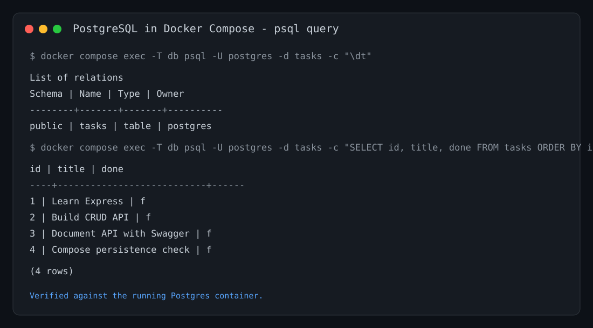

# Todo-CRUD-API

A beginner-friendly CRUD API for managing tasks. It uses Node.js, Express, PostgreSQL, and Docker Compose so tasks survive full stack restarts.

## Features

- Root and health-check endpoints
- Create, read, update, and delete tasks
- Input validation and clear JSON errors
- Interactive Swagger UI documentation
- PostgreSQL persistence with Docker Compose

## Technology stack

- Node.js
- Express
- JavaScript
- swagger-ui-express
- OpenAPI 3.0
- PostgreSQL via node-postgres (`pg`)
- Docker and Docker Compose

## Installation

```bash
npm install
```

## Run the complete stack

```bash
cp .env.example .env
docker compose up
```

Docker Compose starts both the API and PostgreSQL database with one command. The API is available at <http://localhost:3000>.

To stop the stack, press `Ctrl+C` and run:

```bash
docker compose down
```

The Postgres volume keeps task data even after `docker compose down` and `docker compose up`.

Swagger UI: <http://localhost:3000/docs>

## API endpoints

| Method | Endpoint | Purpose | Success status |
| --- | --- | --- | --- |
| GET | `/` | Show API name, version, and task endpoint | 200 |
| GET | `/health` | Check that the API is running | 200 |
| GET | `/tasks` | Get all tasks | 200 |
| GET | `/tasks/:id` | Get one task by ID | 200 |
| POST | `/tasks` | Create a task | 201 |
| PUT | `/tasks/:id` | Update a task title and/or completion state | 200 |
| DELETE | `/tasks/:id` | Delete a task | 204 |

## Status codes

| Status | Meaning |
| --- | --- |
| 200 | Request completed successfully. |
| 201 | A task was created successfully. |
| 204 | A task was deleted successfully; the response has no body. |
| 400 | The request body is missing or invalid. |
| 404 | The requested task does not exist. |

## Example request

```bash
curl -i http://localhost:3000/tasks/1
```

Example output:

```text
HTTP/1.1 200 OK
Content-Type: application/json; charset=utf-8

{"id":1,"title":"Learn Express","done":false}
```

## Swagger UI screenshot

The Swagger UI is available at <http://localhost:3000/docs> and displays the complete task CRUD API. It includes **Try it out** controls that send requests directly to the local Express server.

## PostgreSQL database and environment variables

PostgreSQL runs as a separate Docker container. The API connects using `DATABASE_URL`, and the Docker setup uses `POSTGRES_USER`, `POSTGRES_PASSWORD`, and `POSTGRES_DB` from `.env`.

`.env` is Git-ignored to prevent database credentials from being committed. Copy `.env.example` to `.env` before running the project. When the API starts, it automatically creates the `tasks` table and seeds the three example tasks only when the table is empty.

## Inspect the database

Connect DBeaver to `localhost:5432` with the values from `.env`, then run:

```sql
SELECT COUNT(*) FROM tasks;
```

This query returns the number of task rows in PostgreSQL. You can also use Docker directly:

```bash
docker compose exec db psql -U postgres -d tasks -c "SELECT * FROM tasks;"
```

### PostgreSQL database screenshot

The following `psql` result was captured from the running Docker Compose Postgres container. It shows the automatically created `tasks` table and its stored task rows.



The API endpoint tests from Weeks 2 and 3 still pass because the routes did not change; only the storage layer changed from memory, to SQLite, to Postgres.
