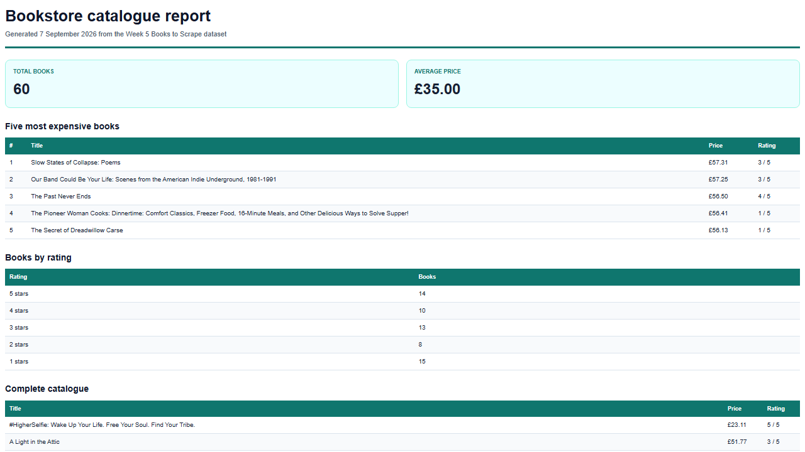

# PDF report generator

This standalone Week 4/A8 project turns the 60 validated Books to Scrape records from Week 5 into a SQLite-backed PDF report. It is separate from the task API and the visual AI workflow project.

## Dataset

The project reuses `../scraper/output/books.json`, then seeds a local SQLite `books` table with title, price, rating, and product URL.

The seed script deletes old rows first, so running it twice still leaves exactly 60 records.

## Aggregation SQL

```sql
SELECT COUNT(*) AS total_books, ROUND(AVG(price), 2) AS average_price FROM books;
SELECT title, price, rating, url FROM books ORDER BY price DESC, title ASC LIMIT 5;
SELECT rating, COUNT(*) AS count FROM books GROUP BY rating ORDER BY rating DESC;
```

## PDF layout

The report is rendered by headless Chromium from HTML. Print CSS uses a repeating `<thead>` and `tr { break-inside: avoid; }`, so the long catalogue table remains readable across pages.

## Generate and download

With the API running at port 3100:

```bash
curl -i -X POST http://localhost:3100/reports
# HTTP/1.1 201 Created
# {"id":1,"created_at":"...","file":"/reports/1/file"}

curl -o my-bookstore-report.pdf http://localhost:3100/reports/1/file
```

Verified locally on 2026-09-07: the API created a PDF with `201`, served it by its `/reports/:id/file` link, and the downloaded file was a real three-page PDF (about 66 KB).

The generation endpoint intentionally waits a few seconds for Chromium to create the PDF. For a large report or many users, I would move rendering to a background job; keeping it in the request is appropriate for this assignment's small dataset.

## Idempotency

The first `POST /reports` on a day creates one PDF. A second normal request on the same day returns `200` with the same report ID and file link, protecting against a double-click (and, in a real system, avoids duplicate work or duplicate emails). Send `{ "force": true }` to create a fresh report deliberately.

```bash
curl -X POST http://localhost:3100/reports -H "Content-Type: application/json" -d '{"force":true}'
curl http://localhost:3100/reports
```

## Generated PDF preview



## API routes

| Method | Route | Result |
| --- | --- | --- |
| `GET` | `/health` | Health status |
| `POST` | `/reports` | Creates a report, or returns today's existing report |
| `GET` | `/reports` | Lists generated reports |
| `GET` | `/reports/:id` | Returns report metadata and download link |
| `GET` | `/reports/:id/file` | Downloads the PDF bytes from disk |

`report.db` and `reports/` are intentionally ignored by Git. They are generated locally by `npm run seed` and `POST /reports`; the code and seed script are the reproducible recipe.

## Setup

```bash
cd pdf-report-generator
npm install
npx playwright install chromium
npm run seed
npm start
```

Health check:

```bash
curl -i http://localhost:3100/health
```
